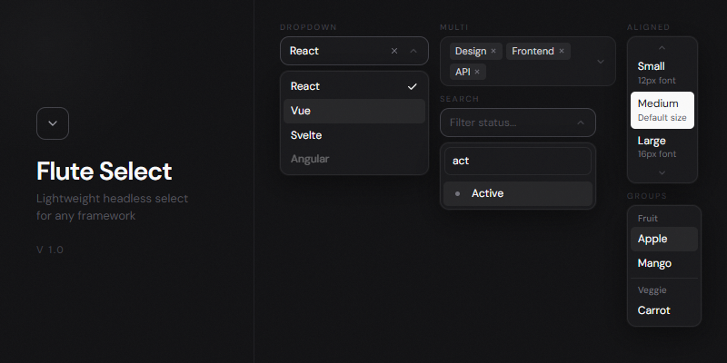

# FluteSelect



Custom select with macOS/Radix-style aligned positioning, multi-select, search, separators, lazy loading, and HTMX support.

## Features

- **Aligned Positioning** — macOS / Radix-style: centers the selected item over the trigger, dynamically calculates dropdown height based on available viewport space above and below
- **Dropdown Positioning** — standard dropdown below the trigger using Floating UI
- **Multi-select** — tag-based UI with remove buttons and `maxItems` limit
- **Separators** — visual dividers between option groups
- **Search** — client-side filtering and server-side with debounce
- **Lazy Loading** — paginated fetch with infinite scroll (IntersectionObserver)
- **Option Groups** — labeled groups with headers
- **Custom Rendering** — `renderOption`, `renderSelected`, `renderTag`, `renderEmpty`
- **Keyboard** — ArrowDown/Up, Enter, Escape, Home/End, Tab, type-ahead
- **HTMX** — `enableHtmx()` for re-init after swap + `observe()` via MutationObserver
- **Creatable** — create new options on the fly
- **Form Integration** — hidden inputs, native `<select>` sync
- **CSS Variables** — 30+ variables for theming (dark/light)
- **Accessible** — ARIA combobox, listbox, option roles

## Quick Start

```bash
cd tools/flute-select
npm install
npm run build
```

Output: `dist/flute-select.js` + `dist/flute-select.css`

```html
<link rel="stylesheet" href="flute-select.css">
<script src="flute-select.js"></script>
```

### Basic

```js
const select = FluteSelect.create('#el', {
  options: [
    { value: 'apple', label: 'Apple' },
    { value: 'banana', label: 'Banana' },
  ],
  placeholder: 'Pick a fruit',
});
```

### From native `<select>`

```html
<select id="fruits" name="fruit">
  <optgroup label="Citrus">
    <option value="orange">Orange</option>
    <option value="lemon">Lemon</option>
  </optgroup>
  <option value="apple" selected>Apple</option>
</select>

<script>
  FluteSelect.fromElement('#fruits');
</script>
```

### Data attributes

```html
<div data-flute-select
     data-placeholder="Choose..."
     data-searchable="true"
     data-source="/api/users"
     data-name="user_id">
</div>
<script>FluteSelect.initAll();</script>
```

### Multi-select

```js
FluteSelect.create('#tags', {
  multiple: true,
  maxItems: 5,
  searchable: true,
  clearable: true,
  options: [...],
  value: ['js', 'ts'],
});
```

### Aligned Positioning (macOS / Radix style)

The dropdown positions so the selected item overlaps the trigger. Height expands upward and downward from that anchor, constrained by viewport edges. Body scroll is locked while open. Scroll arrows appear when content overflows.

```js
FluteSelect.create('#os', {
  positioning: 'aligned',
  options: [...],
  value: 'banana',
});
```

### Separators

```js
FluteSelect.create('#actions', {
  options: [
    { value: 'edit', label: 'Edit' },
    { value: 'duplicate', label: 'Duplicate' },
    { separator: true },
    { value: 'archive', label: 'Archive' },
    { separator: true },
    { value: 'delete', label: 'Delete' },
  ],
});
```

### Grouped Options

```js
FluteSelect.create('#grouped', {
  options: [
    { label: 'Fruits', options: [{ value: 'apple', label: 'Apple' }] },
    { label: 'Vegs', options: [{ value: 'carrot', label: 'Carrot' }] },
  ],
});
```

### Rich Options

```js
FluteSelect.create('#users', {
  searchable: true,
  options: [
    { value: '1', label: 'John', description: 'john@example.com', image: '/john.jpg' },
    { value: '2', label: 'Jane', icon: '<svg>...</svg>' },
  ],
});
```

### Custom Rendering

```js
FluteSelect.create('#custom', {
  renderOption: (opt, { selected }) => `<div>${opt.label}${selected ? ' ✓' : ''}</div>`,
  renderSelected: (opt) => `<b>${opt.label}</b>`,
  renderTag: (opt) => `<span class="my-tag">${opt.label}</span>`,
  renderEmpty: (q) => `<div>Nothing for "${q}"</div>`,
});
```

### Lazy Loading

```js
FluteSelect.create('#remote', {
  source: '/api/users',
  searchable: true,
  lazy: {
    pageSize: 25,
    searchParam: 'search',
    pageParam: 'page',
    dataPath: 'data',
    lastPagePath: 'meta.last_page',
    debounce: 300,
    headers: { Authorization: 'Bearer token' },
    transformResponse: (json) => json.results.map(u => ({
      value: String(u.id), label: u.name,
    })),
  },
});
```

### Creatable

```js
FluteSelect.create('#tags', {
  multiple: true, searchable: true, creatable: true,
  createLabel: 'Add "{value}"',
  onCreate: async (value) => {
    const res = await fetch('/api/tags', { method: 'POST', body: JSON.stringify({ name: value }) });
    const tag = await res.json();
    return { value: String(tag.id), label: tag.name };
  },
});
```

### HTMX / MutationObserver

```js
FluteSelect.enableHtmx();
FluteSelect.observe();
```

## API

### Static Methods

| Method | Description |
|---|---|
| `create(el, config?)` | Create instance (destroys existing on same element) |
| `fromElement(el)` | Create from `<select>` or `[data-flute-select]` |
| `initAll(selector?)` | Init all matching elements |
| `get(el)` | Get instance by element |
| `destroyAll()` | Destroy all instances |
| `enableHtmx()` | HTMX swap integration |
| `observe(root?)` | MutationObserver auto-init |
| `stopObserving()` | Stop MutationObserver |

### Instance Methods

| Method | Description |
|---|---|
| `open()` / `close()` / `toggle()` | Dropdown control |
| `getValue()` | Returns `string` or `string[]` |
| `setValue(value, silent?)` | Set value programmatically |
| `clear(silent?)` | Clear selection |
| `addOption(option, group?)` | Add option dynamically |
| `removeOption(value)` | Remove option by value |
| `updateOptions(items)` | Replace all options |
| `getOption(value)` | Get option object by value |
| `getSelectedOptions()` | Get selected option objects |
| `enable()` / `disable()` | Toggle disabled state |
| `focus()` | Focus trigger |
| `search(query)` | Programmatic search |
| `hasValue(value)` | Check if value is selected |
| `selectAll()` | Select all (multi only) |
| `deselectAll(silent?)` | Deselect all |
| `loadOptions(url, opts?)` | One-shot fetch options from URL |
| `refresh()` | Re-render preserving state |
| `destroy()` | Cleanup, restore native element |
| `on(event, handler)` | Subscribe (chainable) |
| `off(event, handler)` | Unsubscribe |

### Instance Properties

| Property | Type | Description |
|---|---|---|
| `isOpen` | `boolean` | Whether the dropdown is open |
| `isDisabled` | `boolean` | Whether the select is disabled |
| `options` | `SelectOption[]` | Copy of all options |
| `count` | `number` | Total option count |
| `selectedCount` | `number` | Selected option count |
| `element` | `HTMLElement` | The container DOM element |

### Events

| Event | Data |
|---|---|
| `change` | `{ value, option }` |
| `open` / `close` | — |
| `search` | `{ query }` |
| `create` | `{ option }` |
| `load` | `{ options, page }` |
| `focus` / `blur` | — |

DOM events: `fs:change`, `fs:open`, `fs:close` on the container element (with `bubbles: true`).

### Config

```ts
interface SelectConfig {
  options: SelectItem[];
  source: string;                      // Remote URL → enables lazy loading
  lazy: Partial<LazyConfig>;
  multiple: boolean;                   // default: false
  searchable: boolean;                 // default: false
  placeholder: string;                 // default: "Select..."
  searchPlaceholder: string;           // default: "Search..."
  positioning: 'dropdown' | 'aligned'; // default: "dropdown"
  size: 'sm' | 'md' | 'lg';           // default: "md"
  clearable: boolean;                  // default: false
  creatable: boolean;                  // default: false
  createLabel: string;                 // default: 'Create "{value}"'
  disabled: boolean;                   // default: false
  maxItems: number;                    // 0 = unlimited
  maxHeight: number;                   // default: 300 (dropdown mode)
  closeOnSelect: boolean | null;       // null = auto (true single, false multi)
  name: string;                        // hidden input name for forms
  value: string | string[];
  cssClass: string;                    // extra class on container
  flip: boolean;                       // default: true (dropdown mode)
  animationDuration: number;           // default: 150
  zIndex: number;                      // default: 9999
  portalTo: HTMLElement | string | null;
  emptyText: string;                   // default: "No options found"
  loadingText: string;                 // default: "Loading..."

  renderOption?(opt, state): string;
  renderSelected?(opt): string;
  renderTag?(opt): string;
  renderEmpty?(query): string;

  onChange?(value, option): void;
  onOpen?(): void;
  onClose?(): void;
  onSearch?(query): void;
  onCreate?(value): SelectOption | Promise<SelectOption>;
}
```

### LazyConfig

```ts
interface LazyConfig {
  pageSize: number;            // default: 20
  searchParam: string;         // default: "q"
  pageParam: string;           // default: "page"
  pageSizeParam: string;       // default: "per_page"
  dataPath: string;            // default: "data"
  totalPath: string;           // default: "meta.total"
  lastPagePath: string;        // default: "meta.last_page"
  headers: Record<string, string>;
  transformResponse: ((data) => SelectOption[]) | null;
  debounce: number;            // default: 300
  loadOnInit: boolean;         // default: false
}
```

### Types

```ts
interface SelectOption {
  value: string;
  label: string;
  html?: string;
  disabled?: boolean;
  image?: string;
  icon?: string;
  description?: string;
  data?: Record<string, unknown>;
}

interface SelectGroup {
  label: string;
  options: SelectOption[];
}

interface SelectSeparator {
  separator: true;
}

type SelectItem = SelectOption | SelectGroup | SelectSeparator;
```

## CSS Variables

Override on `:root`, `.fs`, or any parent:

```css
.my-form {
  --fs-bg: #2d2d30;
  --fs-bg-accent: #ff6b35;
  --fs-radius: 12px;
}
```

Light theme: `[data-theme="light"]` parent or `.fs--light` class.

| Variable | Default (dark) | Description |
|---|---|---|
| `--fs-font` | system stack | Font family |
| `--fs-font-size` | `13px` | Base font size |
| `--fs-bg` | `#09090b` | Trigger/container background |
| `--fs-bg-popover` | `#0c0c0e` | Dropdown background |
| `--fs-bg-hover` | `rgba(255,255,255,0.06)` | Option hover |
| `--fs-bg-selected` | `rgba(255,255,255,0.06)` | Selected option (dropdown mode) |
| `--fs-bg-highlight` | `rgba(255,255,255,0.08)` | Keyboard highlight |
| `--fs-bg-accent` | `#2563eb` | Selected option accent (aligned mode) |
| `--fs-border` | `#27272a` | Border color |
| `--fs-border-focus` | `#3f3f46` | Focus border color |
| `--fs-ring` | `rgba(161,161,170,0.2)` | Focus ring |
| `--fs-text` | `#fafafa` | Primary text |
| `--fs-text-muted` | `#71717a` | Secondary text |
| `--fs-text-placeholder` | `#52525b` | Placeholder text |
| `--fs-text-disabled` | `#3f3f46` | Disabled text |
| `--fs-radius` | `6px` | Trigger border radius |
| `--fs-radius-popover` | `8px` | Dropdown border radius |
| `--fs-shadow` | `...` | Dropdown shadow |
| `--fs-tag-bg` | `#27272a` | Tag background |
| `--fs-tag-text` | `#d4d4d8` | Tag text color |
| `--fs-tag-radius` | `3px` | Tag border radius |
| `--fs-option-py` | `6px` | Option vertical padding |
| `--fs-option-px` | `8px` | Option horizontal padding |
| `--fs-min-width` | `160px` | Minimum select width |
| `--fs-max-height` | `300px` | Max dropdown height (CSS) |
| `--fs-z-index` | `9999` | Dropdown z-index |
| `--fs-transition` | `80ms ease` | UI transitions |

## Architecture

```
src/
├── index.ts          Entry point, window.FluteSelect binding
├── core.ts           Main FluteSelect class (orchestrator)
├── types.ts          TypeScript interfaces
├── constants.ts      Defaults, CSS class names, SVG icons
├── emitter.ts        Typed event emitter
├── dom.ts            DOM utilities
├── state.ts          Option parsing, groups, selection state
├── renderer.ts       DOM rendering (trigger, dropdown, options, tags, scroll arrows)
├── positioning.ts    Floating UI (dropdown) + macOS-style aligned positioning
├── keyboard.ts       Keyboard navigation
├── search.ts         Client-side filter + debouncer
├── lazy.ts           Remote data fetching with pagination
├── form.ts           Hidden inputs, native <select> sync
└── registry.ts       Instance registry, HTMX, MutationObserver
```

## Development

```bash
npm run build         # typecheck + bundle
npm run build:dev     # watch mode
npm run lint          # ESLint
npm run lint:fix      # ESLint auto-fix
npm run format        # Prettier
npm run format:check  # Prettier check
npm run typecheck     # tsc --noEmit
npm run test          # vitest run
npm run test:watch    # vitest watch
npm run test:coverage # vitest with v8 coverage
npm run ci            # lint + format + typecheck + test
```

## Releasing

```bash
# Bump version, build, tag, push
npm version patch    # or minor / major
git push --follow-tags
```

GitHub Actions will automatically create a release with built assets when a `v*` tag is pushed.

## License

MIT
